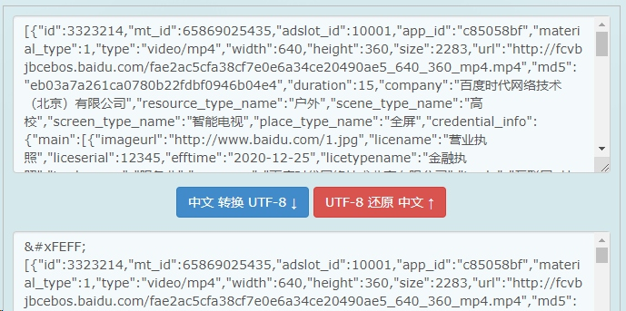

 UTF-8编码中BOM的检测与删除
先解释一个名词BOM,所谓BOM，全称是Byte Order Mark，它是一个Unicode字符，通常出现在文本的开头，用来标识字节序 （Big/LittleEndian），除此以外还可以标识编码（UTF-8/16/32），如果出现在文本中间，则解释为zero width no-breakspace。
<feff>

```php
function  replace_utf8bom( $str )   
{   
    $charset [1] =  substr ( $str ,0,1);   
    $charset [2] =  substr ( $str ,1,1);   
    $charset [3] =  substr ( $str ,2,1);   
    if  (ord( $charset [1]) == 239 && ord( $charset [2]) == 187 && ord( $charset [3]) == 191)   
    {   
        return   substr ( $str ,3);   
    }   
    else    
    {   
        return  false;   
    }   
}  
```